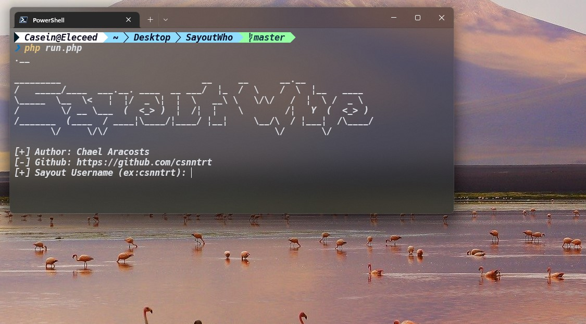
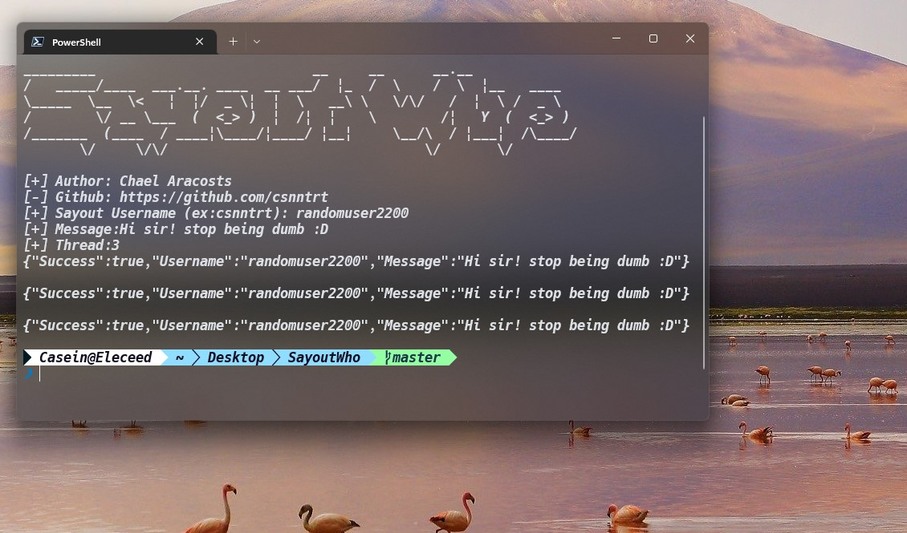
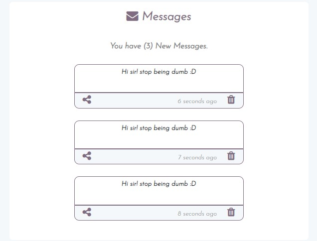

# Sayout who #
## _A Php bot that send mass message for sayout.me_ ##


## How to run


## How to use
* Open Terminal
* Run the file
```php 
php run.php
```
* Add username
* Add Message
* Add Thread (for how many message will send)




## License

MIT

**Free Script**